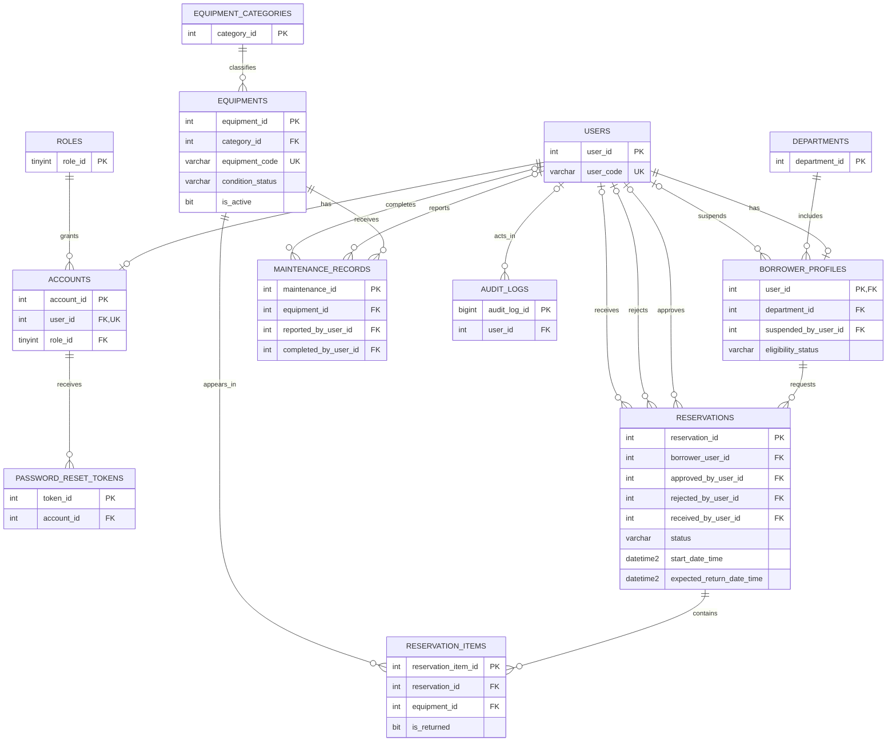

# Proposed HiRAM ERD

This diagram matches `proposed_hiram_schema.sql`. The database uses a borrower
profile for each reservation, and an approved reservation is a distinct state.
Each equipment row represents one physical asset.

## Rules handled in application services

- `(reservation_id, equipment_id)` is unique in the database, so an asset occurs
  only once within a reservation.
- Before approval, check borrower eligibility, at least one item, equipment
  condition, overlapping approved bookings, and scheduled maintenance.
- Before scheduling maintenance, check for overlapping bookings and maintenance.
- Before completing a reservation, check that every item has a return record.
- Do not change the equipment list after the reservation leaves `Pending`.
- Make approval and maintenance scheduling atomic. Use a database transaction with
  suitable isolation or locking, and retry conflicts. A separate availability
  read followed by a later save can approve two requests for the same item.
- `Equipments.availability_status` is intentionally omitted. Current and future
  availability come from reservations, returns, maintenance, and `is_active`.

The SQL file contains no triggers or stored procedures. The service layer owns
the workflow checks listed above. Basic foreign keys, uniqueness, and row-level
checks remain in the database so invalid values and broken links are rejected.

This is a proposed clean-install design. It is not a migration for the current
database, and the existing generated EF models need corresponding changes.
